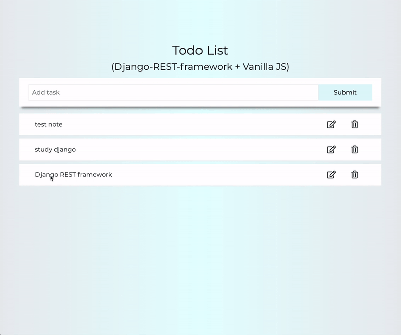

# Todo App (Django REST framework + Vanilla JavaScript)

## Django REST framework + Vanilla JavaScript todos

> python_Django(REST API) + Vanilla JavaScript todo app

## Live Demo
Try the application live at [https://jinho6225.pythonanywhere.com/](https://jinho6225.pythonanywhere.com/)

## Technologies Used
- Vanilla JavaScript
- CSS Variables 
- HTML
- Python
- Django
- Django REST framework (https://www.django-rest-framework.org)

## Features
  - Responsive design
  - User can write todo
  - User can update todo
  - User can delete todo
  - User can check completion of todo

## Preview

